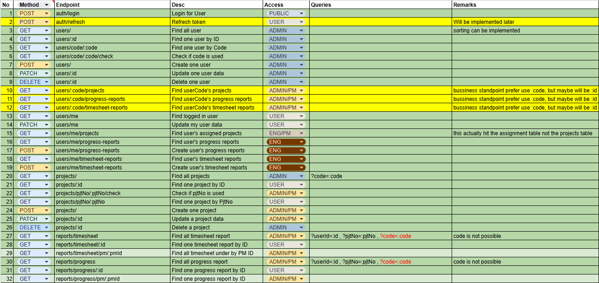
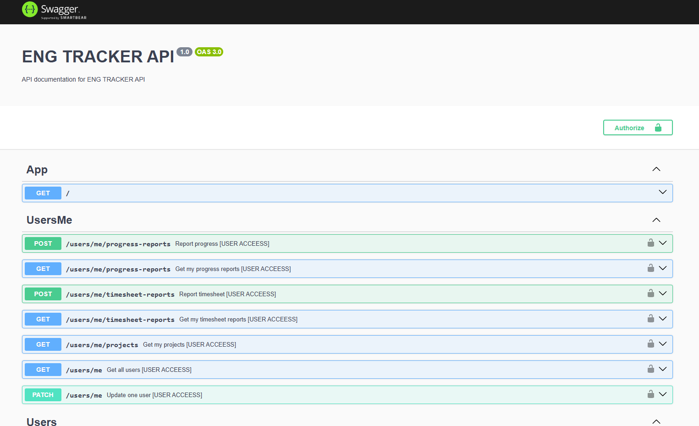
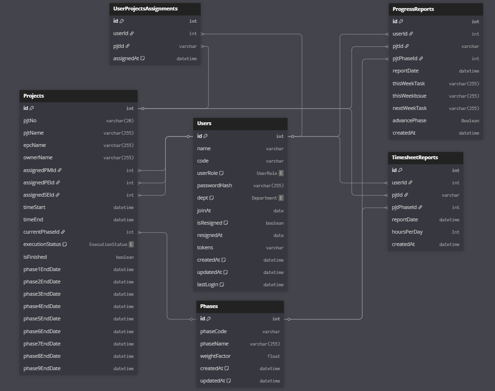

# ENG TRACKER APP BE (C.R.A.C.K - REVOU SHANGHAI)

This is a Back-end app for "Engineer Tracker Web App" that hopefully will be used (in a corporate situation) to track Engineer's daily timesheet and weekly report. Although still lacks a lot of feature, this will serve as a point to what I can understand and achieve up to this day.

From almost a 0-knowledge person when it come to HTTP/CSS/JS/TS, to now building the whole Web App using a pretty sophisticated framework.
I appreciate myself for the effort (~14 days of it), and of course all parties that have made me come this far.

This will not be my last HURRAH.

Ps. Won't be fancy readme, I'm running out of time.

## TLDR: [Deployed BE App](https://final-project-be-kebejoan-production.up.railway.app/)

Go check the face of the project [here](https://final-project-fe-kebejoan.vercel.app/)

Perhaps want to check BE endpoint? [Click Here](https://final-project-be-kebejoan-production.up.railway.app/)

Or check the API Doc [here](https://final-project-be-kebejoan-production.up.railway.app/doc-api)

## 💻 Open This Project Locally

Feel free to open and run the project on your local machine!

1. Clone the repository first
   ```sh
   https://github.com/revou-fsse-feb25/final-project-be-kebejoan.git
   ```
2. Navigate to the folder in your CLI
   ```sh
   cd .\final-project-fe-kebejoan\
   ```
3. Run the code command (might differ in your machine)
   ```sh
   code .
   ```
4. Install packages using package manager
   ```sh
   pnpm install
   ```
5. Deploy on development environment
   ```sh
   pnpm run start:dev
   ```
6. Dont Forget to Add Your Secret
   ```sh
   .env
   ```

## STACK USED

1. NEST JS as the NodeJS App Back End framework
2. JWT as the token and encryption strategy
3. SWAGGER UI as the API Documentation UI
4. BCRYPTJS as the String Encryptor
5. CLASS-VALIDATOR as the Body Validator
6. CLASS-TRANSFORMER as the Body Transformer

## API Contract




## ERD


